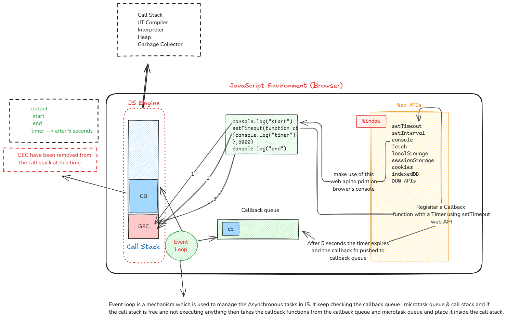

# Event Loop

The event loop itself is a process that continuously monitors and manages how the program executes asynchronous code. It's responsible for making sure that tasks (like user clicks, setTimeout, or network requests) are handled when the main program is ready to process them.

Event loop is a mechanism which is used to manage the Asynchronous tasks in JS. It keep checking the callback queue , microtask queue & call stack and if
the call stack is free and not executing anything then takes the callback functions from the callback queue and microtask queue and place it inside the call stack.

# Microtask Queue V/s Callback Queue

