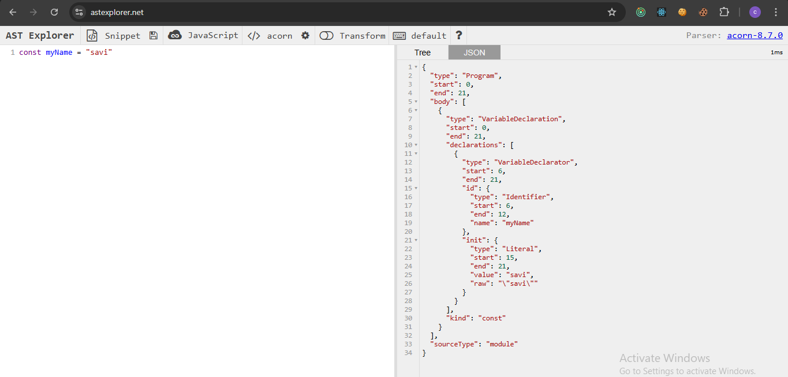
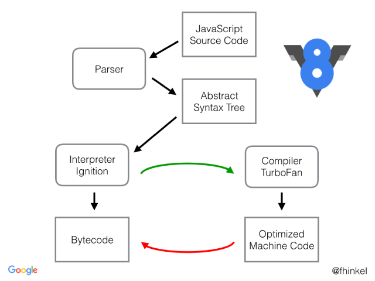

# JavaScript Environment

Browser's are only able to execute the JavaScript code because they only have JavaScript Runtime Environment JavaScript RunTime Environment includes :

1. JavaScript Engine (Chrome's V8, SpiderMonkey)
2. Web APIs
3. Callback Queue
4. Microtask Queue
5. Event Loop

# JavaScript Engine

Different browser's use different JavaScript Engines.
Chrome = V8
Microsoft Edge older = Chakra
Microsoft Edge new = V8
Firefox = SpiderMonkey

A JavaScript engine is a program, not a machine. It takes high-level JavaScript code and converts it into machine code that can be executed by hardware. Chrome's V8 engine is written in C++.
When the JavaScript engine processes code, it follows three main steps:

1. Parsing
2. Compilation
3. Execution

### Parsing

In this first step, the engine breaks the code into tokens. A token is a small, meaningful unit of the code, such as keywords, operators, variables, etc. For example, in the code let x = 5;, the tokens would be let, x, =, 5, and ;.

Once the tokens are generated, the engine performs syntax parsing and creates a Abstract Syntax Tree (AST). The AST represents the structure of the code. For example, an AST for a single line of code looks like this:

### Compilation

After parsing, the engine enters the compilation phase. Here, the JIT (Just-In-Time) Compiler comes into play. The JIT compiler combines the features of both a compiler and an interpreter.

A compiler translates the entire code into machine code before execution, optimizing it in the process.

An interpreter reads and executes code line by line, without converting it to machine code all at once.

The JIT compiler does both: it compiles parts of the code while executing it, optimizing the code during runtime. Some engines also use AOT (Ahead-of-Time) Compilation, where the code is compiled and optimized before execution starts. Once this is done, the engine generates bytecode, which is then passed to the execution phase.
V8 interpreter = Ignition
V8 Compiler = Turbofan

Here are the main optimizations that happen during compilation, explained simply:

1. **Constant Folding**: If there are numbers that don’t change (like `2 + 3`), the compiler does the math early, so the program doesn't have to do it while running.
2. **Inlining**: Small functions are directly placed in the code instead of calling the function every time, which makes the program run faster.

3. **Dead Code Elimination**: The compiler removes code that doesn't do anything useful, like parts of the program that will never run.

4. **Loop Optimization**: The compiler makes loops more efficient, like reducing the number of times it needs to run or changing how it works.

5. **Memory Optimization**: The compiler tries to use memory more efficiently so that the program runs faster and doesn’t use too much memory.

6. **Register Allocation**: The compiler stores important variables in the fastest memory (CPU registers) to speed up the program.

### Execution

The execution phase has two main components: the memory heap and the call stack.

- The memory heap is where the engine allocates memory for variables and functions.
- The call stack is where the engine keeps track of function calls and the order in which code should be executed.

### Garbage Collector

A **garbage collector** (GC) is a tool that automatically frees up memory in your program by removing unused data, so your program doesn't run out of memory.

One common method it uses is the **Mark and Sweep** algorithm, which works in two steps:

1. **Mark Phase**: The garbage collector checks which objects (data) in memory are still being used and marks them as "alive."
2. **Sweep Phase**: It then removes the objects that are no longer in use (i.e., "dead") and frees their memory.

### V8 Engine Architecture

