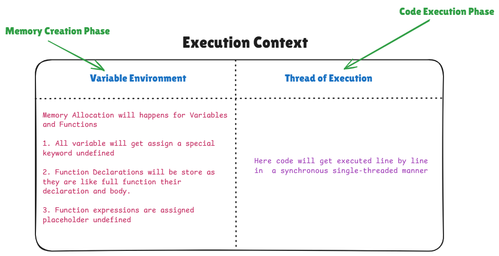

# Execution Context

Everything in Javascript happens inside an Execution Context. Which means whenever we execute any javascript code, it needs an environment inside which it can run and Execution Context is that environment.

### Execution Context has 2 parts/phases

1. Memory Creation Phase (Variable Environment)
2. Code Execution Phase (Thread of Execution)

### Variable Environment

This is the first part of Execution Context. When we click on run button to executed our JS code even before execution of very first line, A Variable Environment part is created inside Execution Context. In this Memory Creation Phase out whole JavaScript code is scanned and memory allocation happens for all variables and functions.
All variable are allocated memories with a special placeholder known as `undefined` and function declarations are stored as it is. Which means whole code of function is stored inside Memory Creation phase for function declarations

**Note :-**
Function Declarations are hoisted, meaning the entire function (both its definition and its body) is available during the Memory Creation phase.

Function Expressions (`like const foo = function() {}`) are not hoisted in the same way. Only the variable foo is hoisted (with an initial value of undefined), and the function expression is assigned during the execution phase. So, function expressions don't have their full body in memory during the Memory Creation phase

### Thread of Execution

After Memory Creation Phase, the Thread of Execution phase kicks in. This mean that the code is now going to executed line by line. And now doing the code execution the variables and function expression we have undefined keyword as placeholder will be replace by their actual values. Remeber JavaScript is a `Synchronous Single Threaded language`.

**Single Threaded :-**

It means that JavaScript Engine or compiler have access to only one virtual CPU thread. Which that it can only executed one statement at a time. It can't run multiple statements in parallel like we can do in Golang and Java.
So in JS we can't use real parallelism.

**Synchronous :-**

It means JavaScript code which get execute in the thread is blocking. Which means that when we execute one statement the main thread (The only single thread) is blocked It can't excuted another statement. So next line has to wait untill first line does not gets executed completely and thread becomes free. That's why you have heard of do not write such code which can block your main thread. Beacuse then rest of your code has to wait till the blocking code finishes and make thread free. One example of this is that if you write a function to calculate Fibonacci sequence and that Fibonacci sequence is large. For that time your main thread will block and your UI will become unresponive and any button click or anything else won't work.

**Note :-**
Web APIs like setTimeout, EventListeners, and fetch make JavaScript capable of handling asynchronous operations. This means tasks such as file reading, writing, or network requests can be delegated to the browser environment or Node.js in the background, while the JavaScript engine continues to execute other tasks without blocking the main thread.

Although JavaScript is usually single-threaded (only doing one thing at a time), we can use Web Workers to run tasks in parallel. Web Workers let us run code on a separate thread, so it doesn’t slow down the main thread that runs the website. This helps when doing things that take up a lot of time, like calculations or processing large amounts of data.
