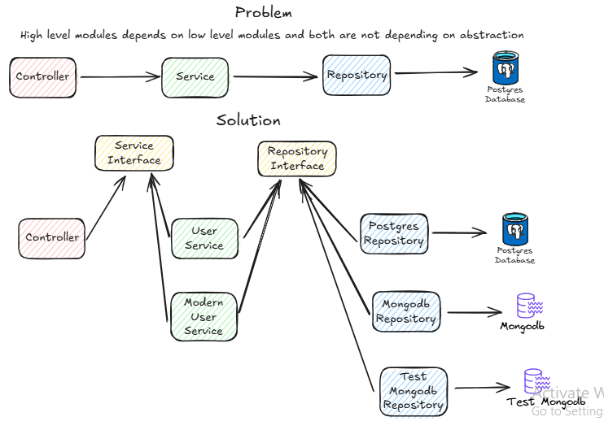

### Dependency Inversion Principle
1. High-level modules should not depend on low-level modules. Both should depend on abstractions (use interfaces ).
2. Abstractions should not depend on details. Details (concrete implementations) should depend on abstractions.

