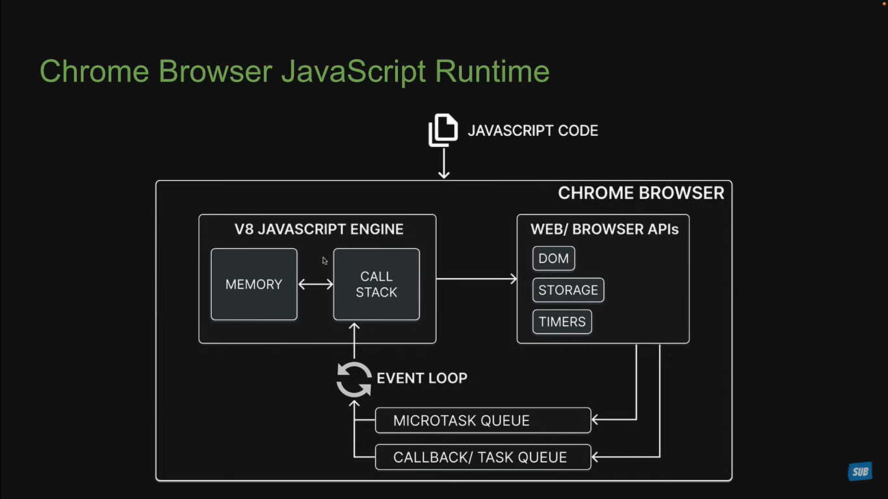
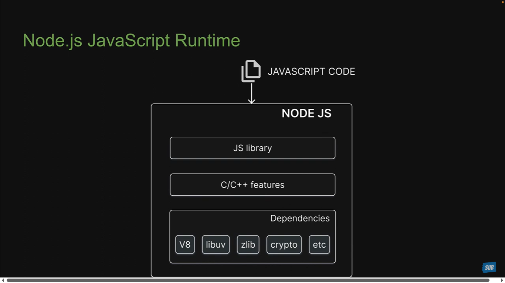

Node.js is an open-source, cross-platform, JavaScript runtime environment.
Open Source – The source code is freely available to everyone.
Cross-Platform – It works on Mac, Linux, and Windows.
JavaScript Runtime – It provides an environment to run JavaScript code outside the browser, using the V8 engine (same as Chrome).

### What is ECMAScript and how it is different from JavaScript?
Back in the 1990s, there was a browser war between Netscape Navigator and Internet Explorer.
Both browsers had their own scripting languages:
Netscape used JavaScript
Internet Explorer used JScript, which was created by reverse-engineering JavaScript
However, JScript had differences in syntax and behavior, which meant developers had to write code twice to make their websites work on both browsers.
To solve this problem, in November 1996, Netscape submitted JavaScript to ECMA International,
an industry association dedicated to the standardization of information and communication systems.
ECMA = European Computer Manufacturers Association
From that point on, ECMA became the official standardization body for JavaScript.
Thus, ECMAScript was created as the standard specification for JavaScript by ECMA International.
JavaScript is the implementation that follows the ECMAScript specification.
ECMAScript is the standard, rulebook, and language specification.
Whenever new features or proposals are introduced, they are:
First proposed to TC39 (the committee managing ECMAScript)
If accepted, added to the ECMAScript specification
Then, JavaScript engines like V8 (Chrome), SpiderMonkey (Firefox), and JavaScriptCore (Safari) implement them.

### What is JavaScript Engine?
JavaScript Engine is a program which executes our JavaScript code. It compiles (interprets) the High Level JS code that we wrote to low level machine code so OS can undertsand it and executes it to do task.

Every browser has a JS Engine. 
Chrome = V8
Firefox = SpiderMonkey
Modern Edge = V8

V8 Engine -> It is a C++ code that takes the JavaScript code and converts it to Machine Code then executes it. Because JavaScript as a language is not build for servers and does not access OS, FS etc. That's why we use C++ Bindings.

### What is JavaScript Runtime?
A JavaScript runtime is an environment which provides all the necessary component to run a JavaScript Program.

JavaScript Engine is one component of JavaScript Runtime Environment.

### What is Node.js?
Node.js is a JavaScript Runtime Environment. It is not a language, not a framework just a runtime, which runs our JavaScript code outside a browser. Node.js runtime environment consists of Chrome's V8 engine which is written in C++ and compiles high level javascript code to low level machine code. Without V8 Node.js won't be able to execute the JavaScript code. It has some dependencies like 
Libuv which gives access to asynchronous I/O, Crypto for cryptographic operations and Zlip for compression. All these dependencies comes in the deps folder.

In the src folder we have C++ code where there are C++ features such as handling File System, Networking etc. Because JavaScript as a language can't handle these low level operations

In the lib folder we have JavaScript code written to access these C++ Features in the src folder ans some other utilities.

### Node.js V/s Browser
Node.js does not have web apis like document, cookies, locatStorage and and events like click, onchange events. Here the this key do not points to winodw object but to nod eglobal object.

Similiarly browser's do not have access to features like File Handling and crypto & http modules.

